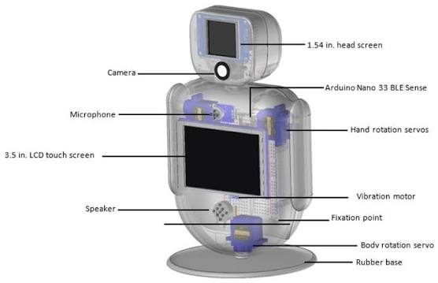
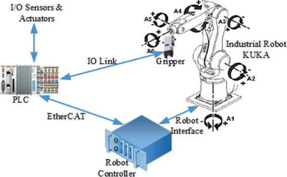
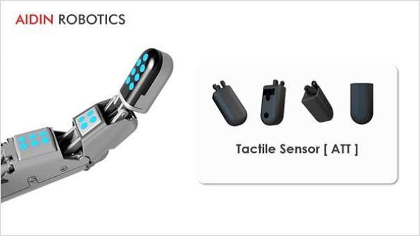
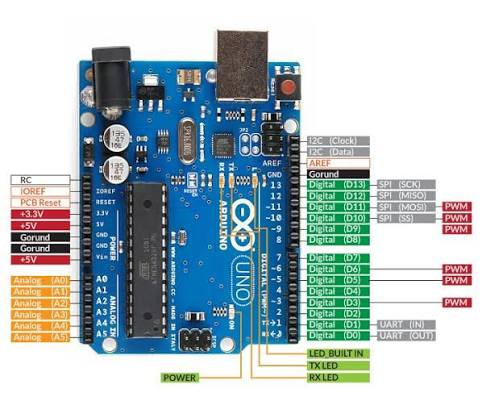
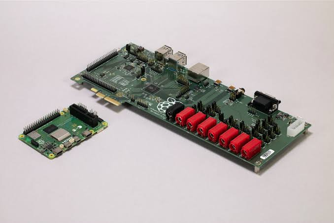
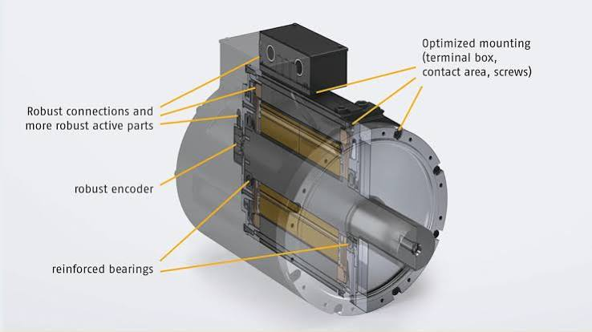

# 🤖 RoboNova
# Phase 0 - Week 1 - Day 2

# Topic: Robot Anatomy & Components

---

# Robot Anatomy

## Description

A robot is made up of several major components that work together to perform tasks.

### Main Components

- Sensors
- Controller
- Actuators
- Mechanical Body
- Power Supply
- Communication Module

### RoboNova

RoboNova will combine all these components to sense, think, and act in a home environment.

---

# Robot Architecture

## Description

The basic workflow of a robot is:

Environment → Sensors → Controller → Actuators

This process allows the robot to receive information, make decisions, and perform actions.

### RoboNova

RoboNova will use this same architecture for all future tasks.

---

# Robot Sensors

## Description

Sensors collect information from the environment and send electrical signals to the controller.

### Examples

- Camera
- Microphone
- Ultrasonic Sensor
- Temperature Sensor
- Touch Sensor

### RoboNova

These sensors will allow RoboNova to see, hear, detect obstacles, measure temperature, and detect touch.

---

# Arduino Uno

## Description

Arduino Uno is a microcontroller board that reads sensor data and controls hardware.

### Features

- Reads sensors
- Controls motors
- Low power
- Real-time control

### RoboNova

Arduino will control RoboNova's hardware such as motors and sensors.

---

# Raspberry Pi

## Description

Raspberry Pi is a single-board computer capable of running Linux and Python applications.

### Features

- Runs Linux
- AI Processing
- Computer Vision
- Voice Assistant

### RoboNova

Raspberry Pi will act as RoboNova's AI brain for speech, vision, and intelligent decision-making.

---

# Servo Motor

## Description

A servo motor is an actuator that moves to a precise angle.

### Applications

- Robot arms
- Head movement
- Camera movement
- Joints

### RoboNova

Servo motors will control RoboNova's head, arms, and other movable joints.

---

# Summary

A robot consists of sensors, a controller, actuators, a mechanical body, a power supply, and communication modules.

For RoboNova:

- Arduino Uno → Hardware Control
- Raspberry Pi → AI & Computer Vision
- Sensors → Perception
- Actuators → Movement
- Battery → Power
- Communication → Wi-Fi, Bluetooth, USB
