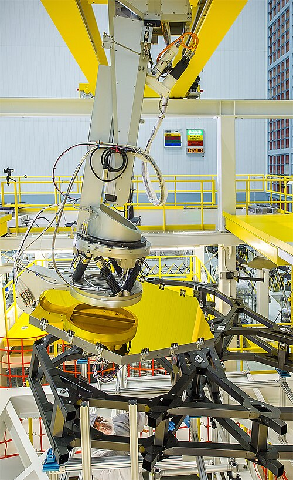
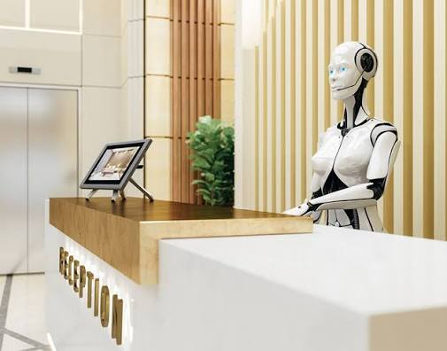
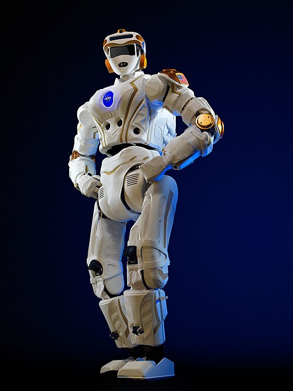
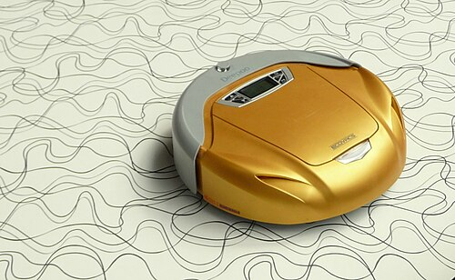
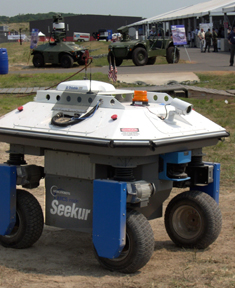
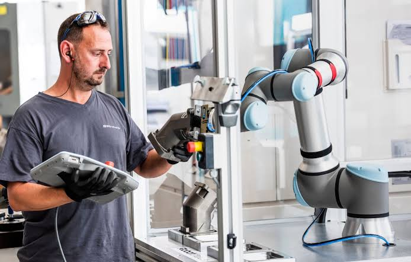

# 🤖 RoboNova
# Phase 0 - Week 1 - Day 3

# Topic: Types of Robots

## Learning Objectives

- Understand the major types of robots.
- Learn the purpose of each robot type.
- Identify where RoboNova fits.
- Compare different robot categories.

---

# 1. Industrial Robots

## Description

Industrial robots are designed to perform manufacturing tasks in factories. They are highly accurate, fast, and usually fixed in one location.

### Applications

- Car manufacturing
- Welding
- Painting
- Pick and Place

### RoboNova

❌ RoboNova is not an industrial robot because it is designed to assist humans rather than manufacture products.

---

# 2. Service Robots

## Description

Service robots assist humans by performing useful tasks in homes, hospitals, hotels, and offices.

### Applications

- Home assistants
- Hospital delivery
- Hotel service
- Food delivery

### RoboNova

✅ RoboNova is a service robot because it is designed to help people with household tasks.

---

# 3. Humanoid Robots

## Description

Humanoid robots are designed to resemble the human body with features such as a head, torso, arms, and legs.

### Applications

- Research
- Human interaction
- Education
- Entertainment

### RoboNova

✅ RoboNova will have a human-like appearance, making it a humanoid robot.

---

# 4. Mobile Robots

## Description

Mobile robots can move from one place to another using wheels, tracks, or legs.

### Applications

- Warehouse robots
- Delivery robots
- Exploration robots

### RoboNova

✅ RoboNova is a mobile robot because it will move around to perform tasks.

---

# 5. Autonomous Robots

## Description

Autonomous robots perform tasks with little or no human intervention by sensing, thinking, and acting independently.

### Applications

- Self-driving vehicles
- Delivery robots
- Space exploration

### RoboNova

✅ RoboNova is planned to become autonomous by making its own decisions while performing tasks.

---

# 6. Collaborative Robots (Cobots)

## Description

Collaborative robots (Cobots) are designed to safely work alongside humans.

### Applications

- Assembly lines
- Packaging
- Quality inspection

### RoboNova

⚠ RoboNova is not primarily a cobot, but some collaborative features may be added in the future.

---

# Summary

A robot can belong to multiple categories.

RoboNova will be:

- Service Robot
- Humanoid Robot
- Mobile Robot
- Autonomous Robot

This combination allows RoboNova to interact with people, move independently, and perform useful household tasks.