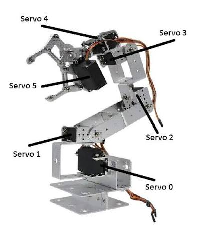
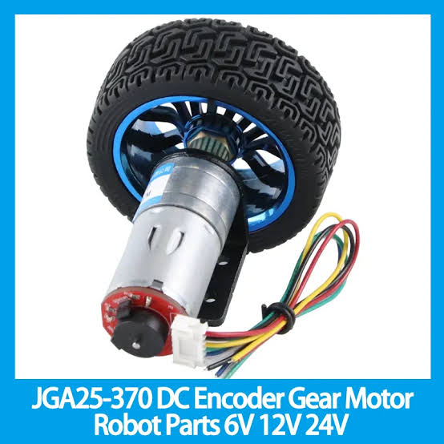
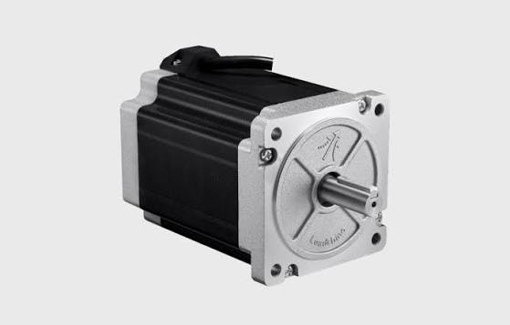
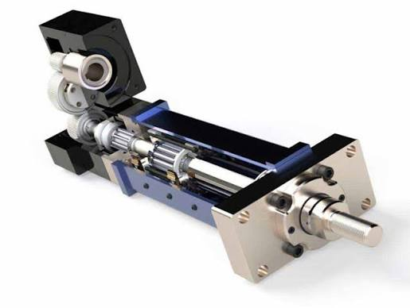

# 🤖 RoboNova

# Phase 0 – Week 1 – Day 5

# Notes

# Topic: Robot Actuators

## What is an Actuator?

An actuator is a device that converts electrical, hydraulic, or pneumatic energy into mechanical movement. It receives commands from the controller and performs the required physical action.

**Simple Definition:**

> An actuator is the muscle of a robot.

---

# Why are Actuators Called Robot Muscles?

Just as human muscles move the body after receiving signals from the brain, actuators move robot parts after receiving commands from the controller.

Human Body → Robot

* Brain → Controller
* Muscles → Actuators
* Bones → Links
* Joints → Robot Joints
* Eyes → Sensors

---

# Robot Decision Flow

```text
Environment
      ↓
Sensors
      ↓
Controller
      ↓
Actuator
      ↓
Movement
      ↓
Action
```

---

# Motor vs Actuator

## Motor

A motor is a device that produces movement, usually rotational movement.

Examples:

* DC Motor
* Servo Motor
* Stepper Motor

## Actuator

An actuator is any device that creates mechanical movement.

Examples:

* Servo Motor
* DC Motor
* Stepper Motor
* Linear Actuator

**Important Rule:**

> Every motor used to create movement is an actuator, but actuators are a broader category than motors.

---

# Types of Actuators

## 1. Servo Motor

### Movement

* Precise rotational movement
* Fixed angle positioning

### Advantages

* High accuracy
* Easy to control
* Holds position

### Applications

* Shoulder
* Elbow
* Wrist
* Neck
* Camera



---

## 2. DC Motor

### Movement

* Continuous rotation

### Advantages

* High speed
* Powerful
* Low cost

### Applications

* Robot wheels
* Fans
* Conveyor systems

---

## 3. Stepper Motor

### Movement

* Step-by-step rotation

### Advantages

* Very precise positioning
* Excellent control

### Applications

* 3D Printers
* CNC Machines
* Precision positioning systems


---

## 4. Linear Actuator

### Movement

* Linear (straight-line) movement

### Advantages

* Strong pushing and pulling
* Accurate extension and retraction

### Applications

* Extendable robot arm
* Lifting mechanism
* Adjustable height systems

---

# Choosing the Correct Actuator

| Robot Part       | Recommended Actuator | Reason                   |
| ---------------- | -------------------- | ------------------------ |
| Shoulder         | Servo Motor          | Precise rotation         |
| Elbow            | Servo Motor          | Fixed-angle movement     |
| Wrist            | Servo Motor          | Accurate positioning     |
| Camera           | Servo Motor          | Controlled viewing angle |
| Wheels           | DC Motor             | Continuous rotation      |
| Precision System | Stepper Motor        | Step-by-step accuracy    |
| Extendable Arm   | Linear Actuator      | Linear movement          |

---

# RoboNova Design Decision

For the first version of RoboNova:

* Servo motors will control the shoulder, elbow, wrist, neck, and camera.
* DC motors will drive the wheels.
* Stepper motors may be used in future precision mechanisms.
* Linear actuators may be added later for extendable or lifting mechanisms.

---

# Key Takeaways

* An actuator converts energy into movement.
* Actuators are the muscles of a robot.
* The controller makes decisions; actuators execute them.
* Servo motors provide precise angle control.
* DC motors provide continuous rotation.
* Stepper motors provide precise step-by-step movement.
* Linear actuators provide straight-line movement.
* Choosing the correct actuator depends on the required movement.
