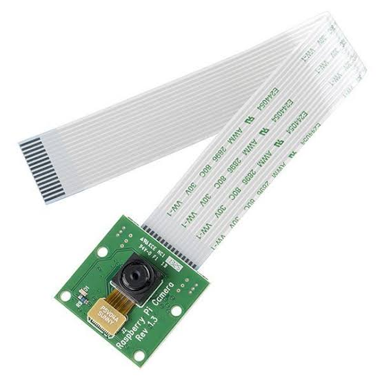
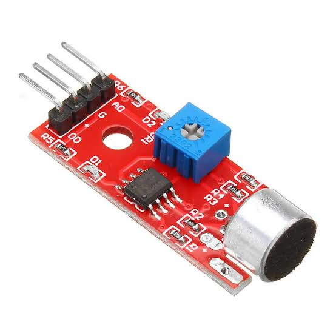
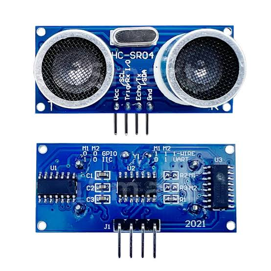
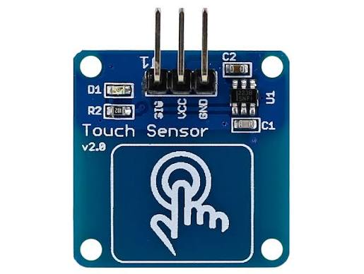
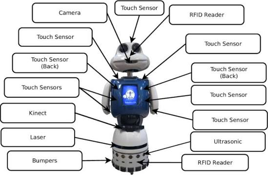
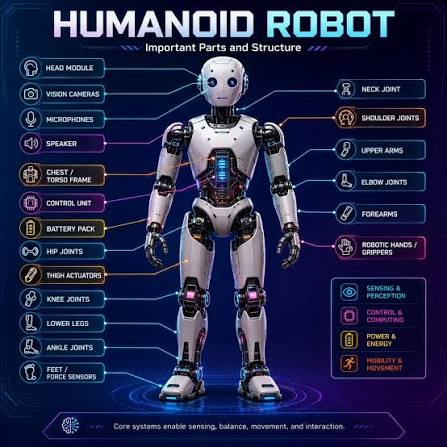

# 🤖 RoboNova

# Phase 0 – Week 1 – Day 6

# Notes

# Topic: Robot Sensors – Vision, Distance & Touch

## Introduction

Sensors are one of the most important components of a robot. They allow a robot to perceive its surroundings by detecting information from the environment and sending it to the controller. Without sensors, a robot cannot make intelligent decisions or perform tasks safely.

---

# Sense → Think → Act

```text
Environment
      ↓
Sensors
      ↓
Controller
      ↓
Decision
      ↓
Actuators
      ↓
Action
```

---

# 1. Camera (Robot's Eyes)



### Purpose

The camera captures images and videos from the environment.

### Applications

* Face recognition
* Object detection
* Navigation
* Hand gesture recognition
* QR code and text recognition

### RoboNova

The camera will help RoboNova recognize people, detect objects, and navigate around the house using computer vision.

---

# 2. Microphone (Robot's Ears)



### Purpose

The microphone detects sound and voice commands.

### Applications

* Voice assistant
* Speech recognition
* Sound detection
* Alarm detection

### RoboNova

The microphone will allow RoboNova to communicate naturally and respond to voice commands.

---

# 3. Ultrasonic Sensor (Distance Measurement)



### Purpose

The ultrasonic sensor measures the distance between the robot and nearby objects using ultrasonic sound waves.

### Applications

* Obstacle detection
* Distance measurement
* Collision avoidance

### RoboNova

The ultrasonic sensor will help RoboNova detect obstacles and move safely around the environment.

---

# 4. Touch Sensor (Robot's Skin)



### Purpose

The touch sensor detects physical contact with the robot.

### Applications

* Detect touch
* Button input
* Safety systems
* Human interaction

### RoboNova

When someone touches RoboNova, the touch sensor sends a signal to the controller. RoboNova can then greet the person or respond appropriately.

---

# 5. Sensor Working Principle



### Workflow

Environment → Sensor → Controller → Decision → Actuator → Action

All sensors collect information and send it to the controller. The controller processes the data, makes a decision, and instructs the actuators to perform the required action.

---

# 6. RoboNova Sensor Placement



### Proposed Sensor Locations

* Camera → Head
* Microphone → Head
* Ultrasonic Sensor → Front chest
* Touch Sensors → Hands and shoulders

This arrangement gives RoboNova a better field of view, improved voice detection, effective obstacle avoidance, and natural human interaction.

---

# Human Body vs Robot Sensors

| Human Body          | Robot Sensor      |
| ------------------- | ----------------- |
| Eyes                | Camera            |
| Ears                | Microphone        |
| Skin                | Touch Sensor      |
| Distance Perception | Ultrasonic Sensor |

---

# Key Points

* Sensors allow robots to perceive their surroundings.
* Different sensors perform different tasks.
* The controller combines sensor data to make intelligent decisions.
* RoboNova requires multiple sensors to interact safely with humans and the environment.
* Sensors are the first step in the Sense → Think → Act cycle.

---

# Summary

Today I learned that sensors are essential for intelligent robots. Each sensor has a unique purpose: the camera provides vision, the microphone detects sound, the ultrasonic sensor measures distance, and the touch sensor detects physical contact. Together, these sensors provide the information RoboNova needs to make decisions and perform tasks safely and effectively.
