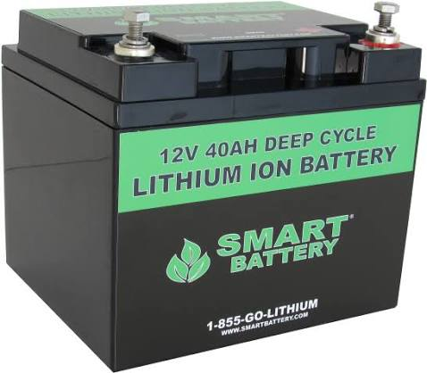
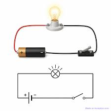
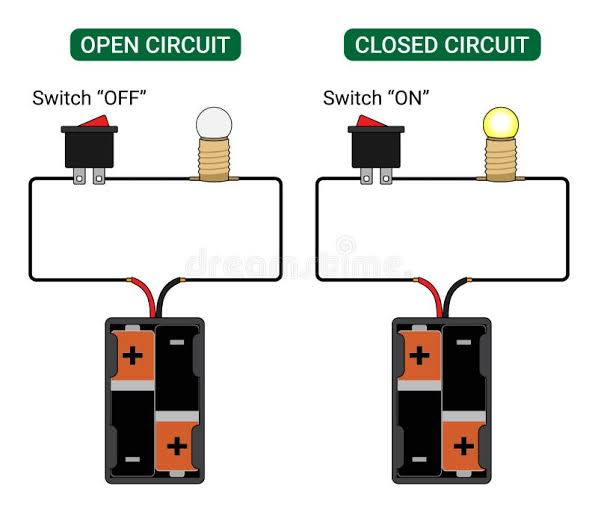
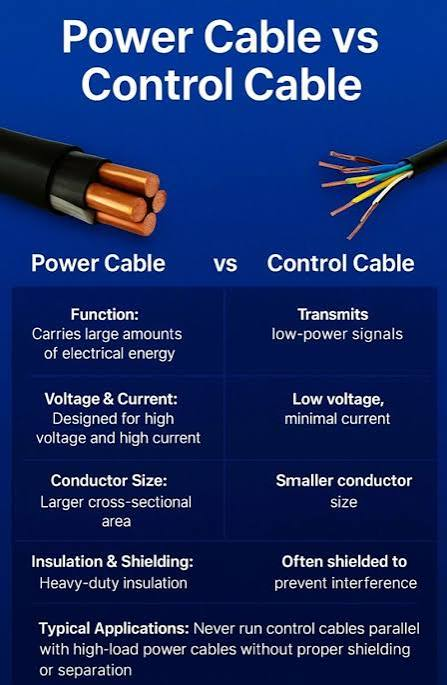
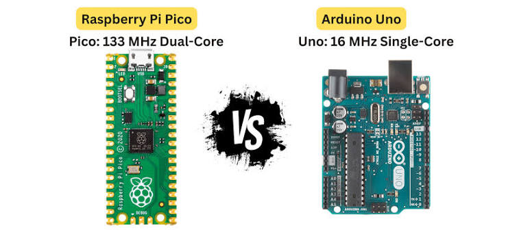
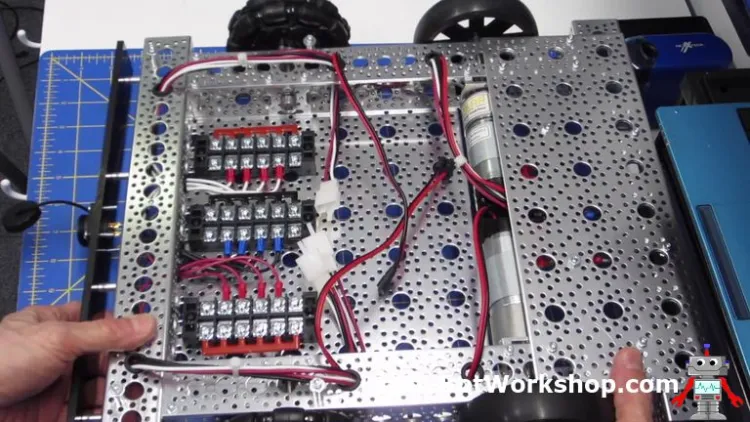
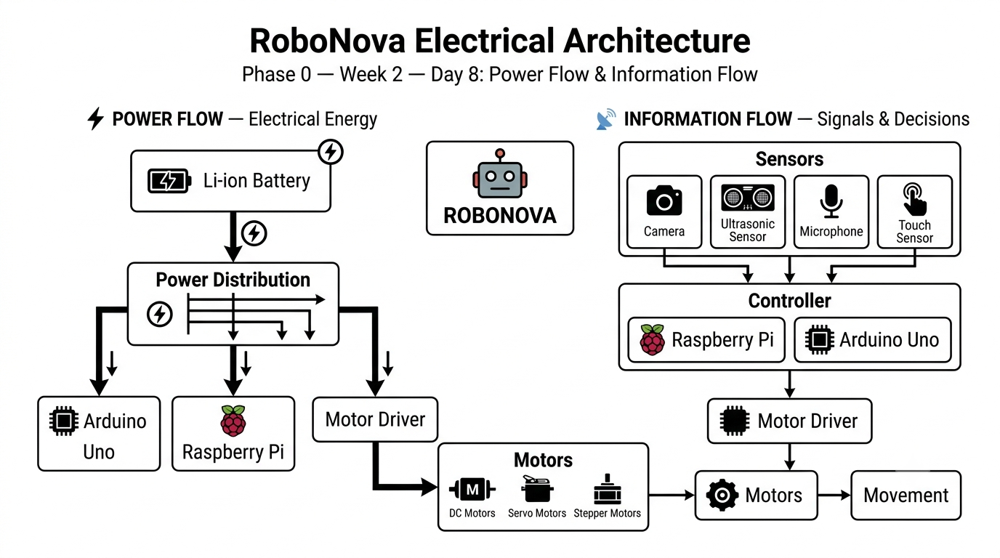

# 🤖 RoboNova

# Phase 0 – Week 2 – Day 8

# Notes

## Topic: Introduction to Electronics & Electricity

---

# 1. What is Electricity?

Electricity is the movement of electric charge through a conductive path. RoboNova needs electrical energy to operate its electronic, electrical, and mechanical components.

Without electricity, the robot cannot operate its sensors, controllers, communication systems, or motors.

---

# 2. Battery — Electrical Energy Source

The battery is RoboNova's primary source of electrical energy.

RoboNova will use a Li-ion battery as its planned power source. The battery stores chemical energy and converts it into electrical energy that can be supplied to the robot's components.



**Image:** Li-ion battery — represents RoboNova's electrical energy source.

---

# 3. Basic Electrical Circuit

An electrical circuit is a complete conductive path that allows electric current to flow.

A basic circuit contains a power source, conductive path, and load.



**Image:** Basic electrical circuit — shows the relationship between the power source, conductive path, and electrical load.

---

# 4. Open and Closed Circuits

A closed circuit provides a complete path for current to flow.

An open circuit has a break in the path, so current cannot flow through the complete circuit.



**Image:** Open vs closed circuit — demonstrates why a complete electrical path is required.

### Closed Circuit

Battery → Wire → Component → Return Path → Battery

### Open Circuit

A break in the path prevents normal current flow.

For RoboNova, a broken connection can prevent a component or subsystem from operating.

---

# 5. Electrical Energy vs Electrical Signal

Electrical energy and electrical signals have different purposes.

### Electrical Energy

Electrical energy provides the power required for components to operate.

Example:

**Battery → Motor**

The battery supplies energy that allows the motor to operate.

### Electrical Signal

An electrical signal carries information between components.

Example:

**Sensor → Controller**

A sensor detects something and communicates that information to the controller through a signal.



**Image:** Electrical energy vs electrical signal — illustrates the difference between powering a component and communicating information.

### Key Idea

> **Energy powers a component, while a signal carries information.**

---

# 6. Controller — Processing Information

The controller is responsible for receiving information from sensors, processing the information, making decisions, and sending control signals to other components.

RoboNova's planned controllers are:

* Raspberry Pi
* Arduino Uno



**Image:** Arduino Uno and Raspberry Pi — examples of controllers that can be used in RoboNova.

A simplified process is:

**Sensor → Controller → Decision → Control Signal**

---

# 7. Motor Driver

A controller can send control signals to a motor driver, but the controller normally should not supply the high current required by a motor directly.

The motor driver acts as an interface between the controller and the motor.


**Image:** Motor driver — provides the interface between the controller and higher-power motor system.

The basic relationship is:

**Controller → Control Signal → Motor Driver → Motor**

The motor driver uses power from the robot's power system to operate the motor according to the controller's commands.

---

# 8. Power Distribution

RoboNova contains several components with different electrical requirements.

The battery supplies the main electrical energy, while the power system distributes and, where necessary, regulates or converts that power for different components.



**Image:** Power distribution — demonstrates how electrical power can be distributed from the battery to different robot components.

A simplified power flow is:

**Battery → Power Distribution → Components**

Possible loads include:

* Sensors
* Raspberry Pi
* Arduino
* Motor drivers
* Motors

The exact voltage and current requirements will be studied in later days.

---

# 9. RoboNova Electrical Architecture

All the concepts learned today can be combined into RoboNova's electrical architecture.



**Image:** RoboNova electrical architecture — combines power flow and information flow within the robot.

### Power Flow

**Battery → Power Distribution → Components**

### Information Flow

**Sensors → Controller → Motor Driver → Motors**

These two flows work together.

The power system provides the electrical energy required by the components, while the information system allows RoboNova to sense its environment, make decisions, and control its actuators.

---

# 10. Power Flow vs Information Flow

This is one of the most important concepts learned today.

## ⚡ Power Flow

The battery provides electrical energy to the robot's power system.

```text
Battery
   ↓
Power Distribution
   ↓
Sensors / Controller / Motor Driver
   ↓
Motor
```

## 📡 Information Flow

Sensors collect information from the environment and communicate it to the controller.

```text
Sensor
   ↓
Electrical Signal
   ↓
Controller
   ↓
Decision
   ↓
Control Signal
   ↓
Motor Driver
   ↓
Motor
```

---

# 11. Electronics vs Robotics

Electronics deals with electrical components, circuits, signals, and electrical systems.

Robotics is broader. It combines:

* Electronics
* Mechanical systems
* Sensors
* Actuators
* Programming
* Control systems
* Artificial intelligence

Therefore:

> **Electronics is one of the foundations of robotics, but robotics is broader than electronics.**

RoboNova combines all of these areas to create a complete robotic system.

---

# 12. RoboNova Example — Avoiding an Obstacle

Suppose RoboNova is moving forward and detects a chair.

### Step 1 — Power

The battery supplies energy to the sensor and controller.

### Step 2 — Sensing

The ultrasonic sensor detects the chair.

### Step 3 — Signal

The sensor sends distance information to the controller through an electrical signal.

### Step 4 — Processing

The controller processes the information.

### Step 5 — Decision

The controller determines that RoboNova needs to change direction.

### Step 6 — Control

The controller sends a control signal to the motor driver.

### Step 7 — Movement

The motor driver uses power from the battery to operate the motors.

### Step 8 — Action

The motors produce mechanical movement and RoboNova changes direction.

---

# 13. Complete Day 8 Concept

```text
                 🤖 RoboNova
                      │
          ┌───────────┴───────────┐
          │                       │
      ⚡ POWER FLOW          📡 INFORMATION FLOW
          │                       │
      🔋 Battery              Sensors
          │                       │
          ▼                       ▼
 Power Distribution          Controller
          │                       │
          │                    Decision
          │                       │
          ▼                       ▼
   Robot Components         Control Signal
                                  │
                                  ▼
                            Motor Driver
                                  │
                                  ▼
                                Motor
                                  │
                                  ▼
                              Movement
```

---

# 14. Key Takeaways

* 🔋 A battery provides electrical energy.
* 🔌 Wires provide conductive paths.
* 🔄 A complete circuit allows current to flow.
* ⚡ Electrical energy powers components.
* 📡 Electrical signals carry information.
* 🧠 Controllers process information and make decisions.
* 🎛️ Motor drivers allow controllers to control higher-power motors.
* ⚙️ Motors convert electrical energy into mechanical movement.
* 🔋 Power distribution supplies components with appropriate electrical power.
* 🤖 Robotics combines electronics, mechanics, software, sensing, and control.

---

# Day 8 Reflection

Today I learned the basic electrical foundation required for RoboNova. I understood that the robot needs both **power flow** and **information flow**. The battery provides electrical energy, while sensors generate information that is processed by the controller. The controller then sends control signals to the motor driver, which uses electrical power to operate the motors.

I also learned the difference between electronics and robotics. Electronics is an important foundation of RoboNova, but robotics combines electronics with mechanical systems, software, sensors, actuators, and control.

The most important concept I learned today is that **power and information are different flows that work together to make RoboNova operate**.
