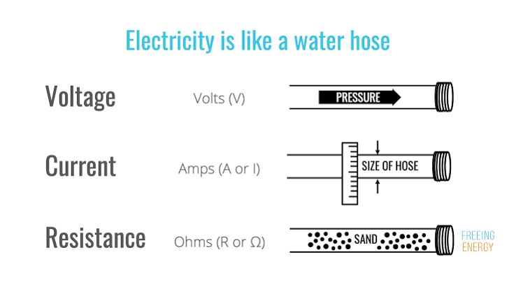
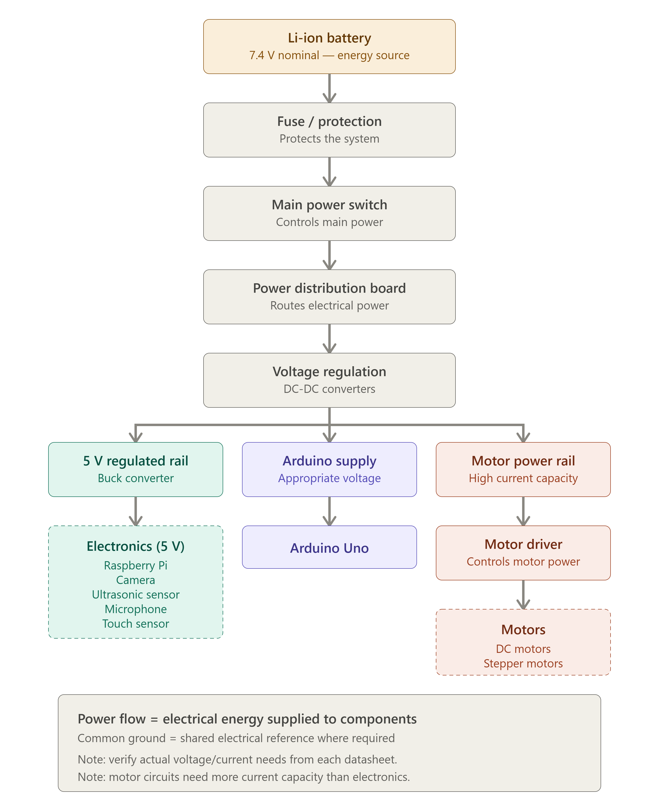
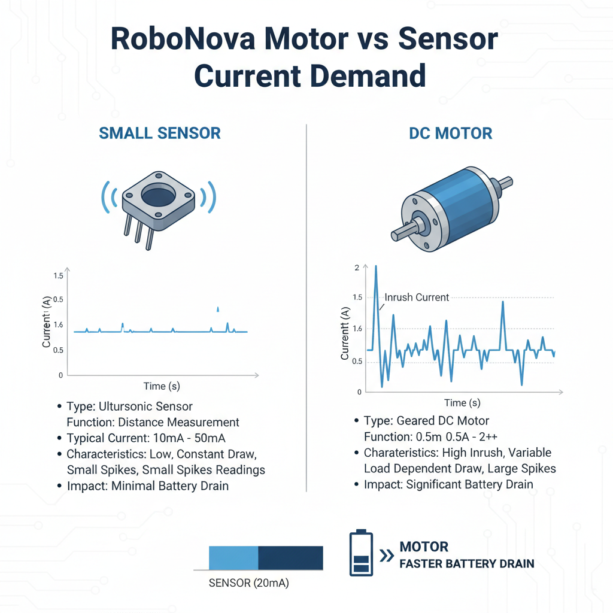
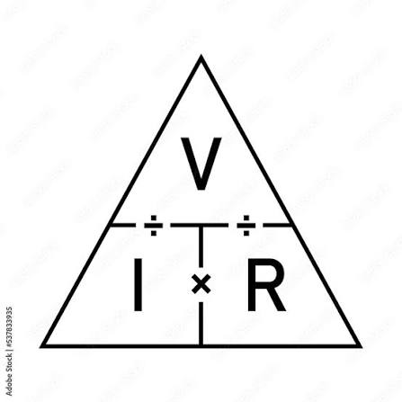

# 🤖 RoboNova — Phase 0 | Week 2 | Day 9

## Voltage, Current, Resistance & Electrical Power

**Project:** RoboNova  
**Phase:** 0 — Robotics Foundation  
**Week:** 2 — Electronics & Electricity  
**Day:** 9

---

## 1. Learning Objectives

Today I learned:

- What voltage is
- What current is
- What resistance is
- The relationship between voltage, current, and resistance
- What electrical power is
- Why RoboNova components have different electrical requirements
- Why voltage regulation is required
- Why motors generally require greater current capability than small sensors
- How electrical concepts help troubleshoot RoboNova

---

# 2. Voltage

## What is Voltage?

**Voltage** is the electrical potential difference that provides the "push" that drives electrical charge through a circuit.

### Unit

Voltage is measured in:

**Volt (V)**

### Simple Understanding

> **Voltage = Electrical Push**

A battery creates a potential difference that can drive current through a complete circuit.

### Water Analogy

Think of voltage like **water pressure**.

Higher pressure can provide a stronger push for water to move through a pipe.

Similarly, voltage provides the electrical push that drives charge through a circuit.



**Figure 1 — Water analogy for understanding voltage, current and resistance.**

---

## RoboNova Application

RoboNova's battery provides the electrical potential required by the electrical system.

However, the battery voltage is not necessarily suitable for every component.

Different components can have different voltage requirements, so appropriate power distribution and voltage regulation may be required.

---

# 3. Current

## What is Current?

**Current** is the flow of electrical charge through a circuit.

### Unit

Current is measured in:

**Ampere (A)**

It is commonly represented by:

**I**

### Simple Understanding

> **Current = Flow of Electrical Charge**

### Water Analogy

Current can be compared to the **flow of water through a pipe**.

More electrical current means more charge is flowing through the circuit per unit time.

---

## RoboNova Application


Different RoboNova components require different amounts of current.

For example:

- Sensors generally require relatively small amounts of current.

- Controllers require current to operate their electronics.
- Motors can require substantially greater current, especially during startup or under mechanical load.

Therefore, RoboNova's battery, wiring, connectors, power distribution system, and motor driver must be capable of supplying the required current.

---

# 4. Resistance

## What is Resistance?

**Resistance** is the opposition to the flow of electrical current.

### Unit

Resistance is measured in:

**Ohm (Ω)**

It is commonly represented by:

**R**

### Simple Understanding

> **Resistance = Opposition to Current Flow**

### Water Analogy

Resistance can be compared to a **restriction in a water pipe**.

A greater restriction makes it harder for water to flow.

Similarly, greater electrical resistance makes it harder for current to flow.

---

## RoboNova Application

Unwanted resistance can occur because of:

- Loose connectors
- Poor connections
- Damaged wires
- Corroded contacts
- Unsuitable wiring

Excessive resistance in a motor circuit can reduce the current available to the motor and cause weak motor performance.

---

# 5. Voltage, Current and Resistance Relationship

Voltage, current and resistance are related through **Ohm's Law**.

The main relationship is:

**V = IR**

Where:

- **V** = Voltage
- **I** = Current
- **R** = Resistance

Therefore:

**I = V / R**

When voltage remains constant:

> Increasing resistance → Current decreases

and:

> Decreasing resistance → Current increases

---



**Figure 2 — Ohm's Law relationship between voltage, current and resistance.**

---

# 6. Basic Electrical Circuit

A basic electrical circuit requires a continuous electrical path for current to flow.

Simplified:

```text
🔋 Battery
    ↓
⚡ Voltage
    ↓
🔄 Current Flow
    ↓
⚙️ Load
    ↓
🔋 Return Path

