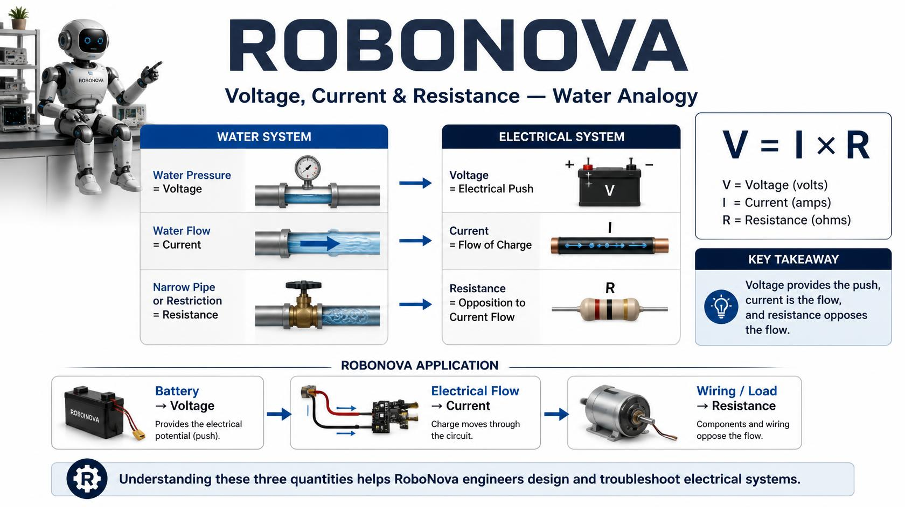
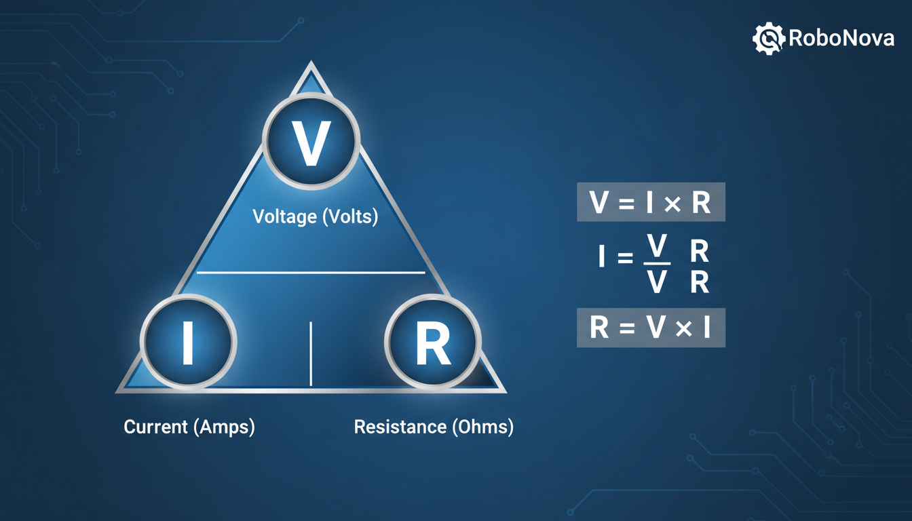
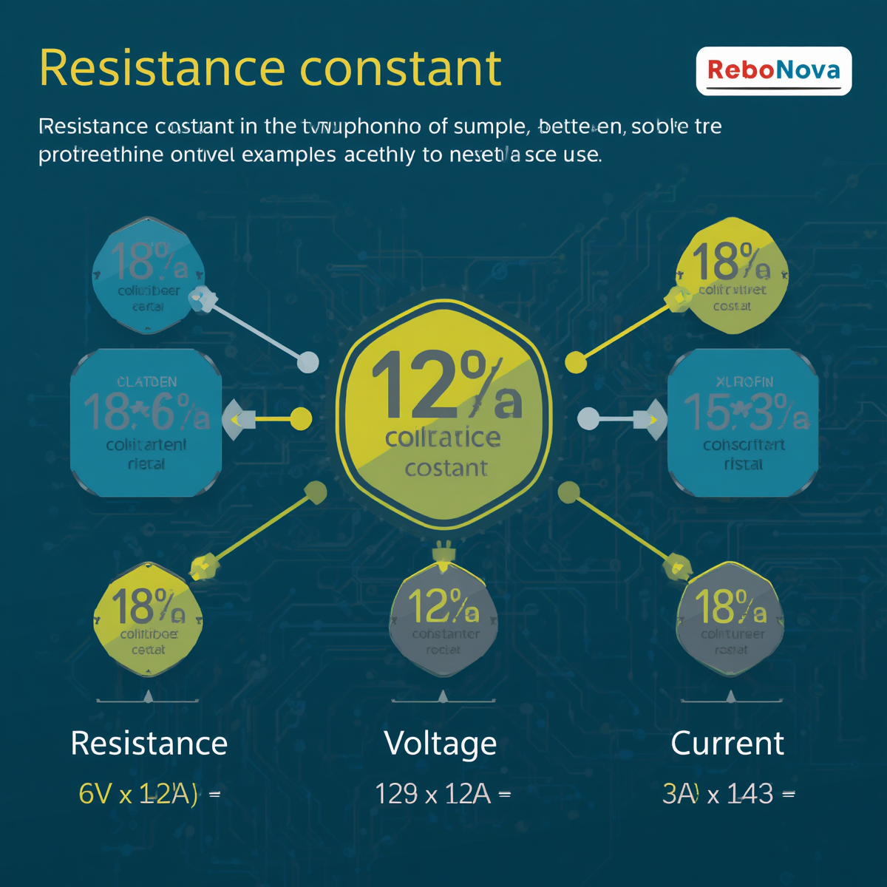
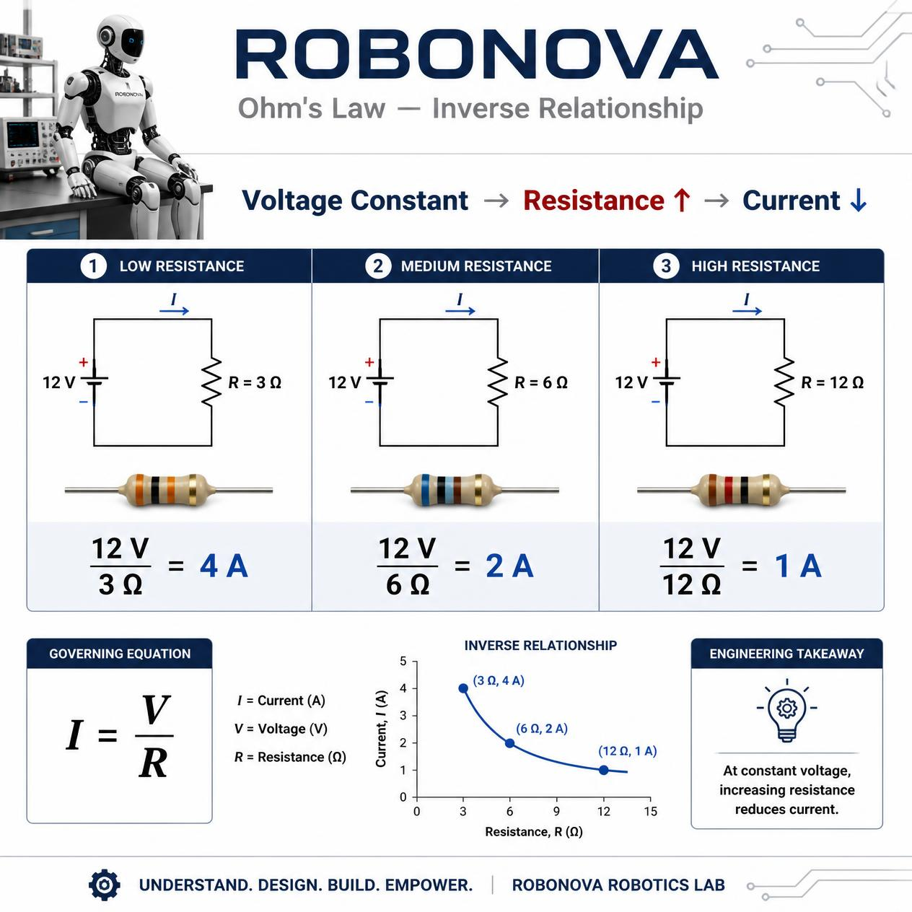
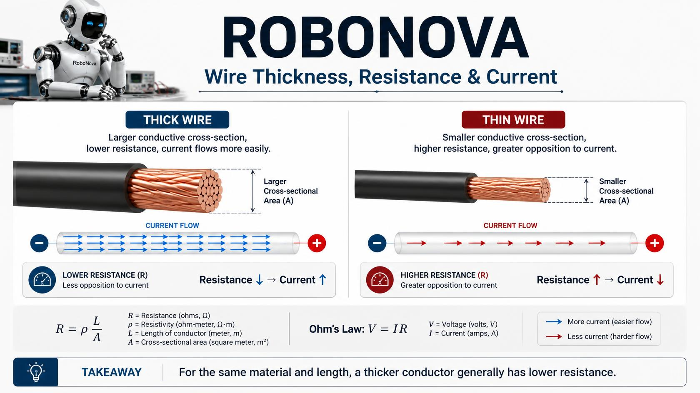
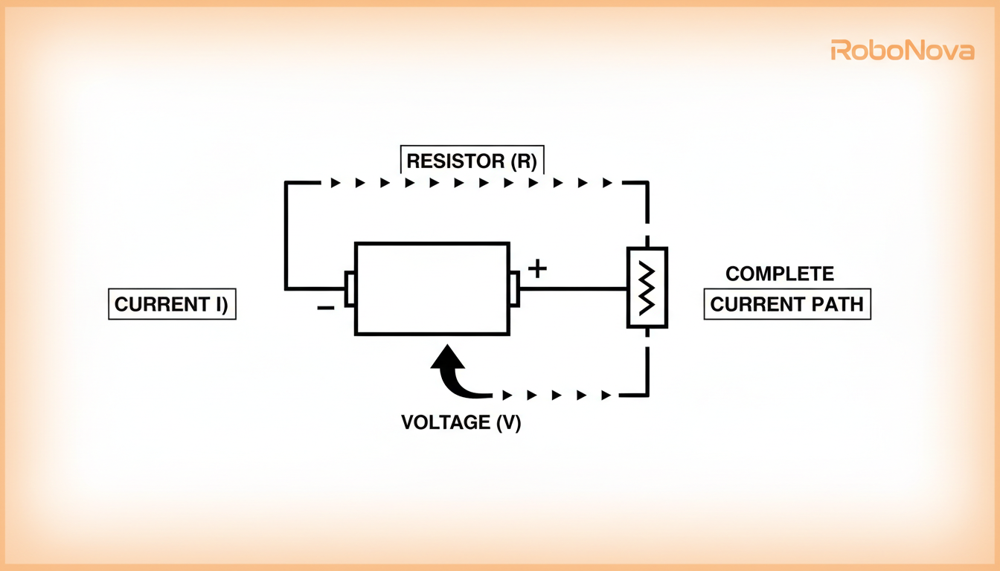
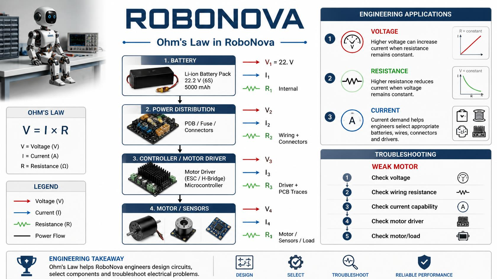

# 🤖 RoboNova — Week 2 → Day 3 Notes

**Phase:** Phase 0 — Robotics Foundation  
**Week:** Week 2 — Electronics & Electricity  
**Day:** Day 3  
**Topic:** Ohm's Law

---

## 🎯 Learning Objectives

By the end of Day 3, I should understand:

- Why Ohm's Law is important
- The relationship between voltage, current, and resistance
- The Ohm's Law equation
- How to calculate voltage
- How to calculate current
- How to calculate resistance
- Direct and inverse relationships
- How resistance affects current
- How Ohm's Law applies to RoboNova
- How Ohm's Law can help troubleshoot electrical problems

---

# 1. Why Ohm's Law Matters

RoboNova contains many electrical components, including:

- Batteries
- Wires
- Sensors
- Arduino
- Raspberry Pi
- Motor drivers
- Motors
- Other electronic components

As an engineer, I need to understand how voltage, current, and resistance interact.

Questions such as:

- How much current will flow?
- What happens if voltage changes?
- What happens if resistance increases?
- Why is a motor drawing too much or too little current?
- Is an electrical circuit operating within safe limits?

can be analyzed using **Ohm's Law**.

> **Ohm's Law provides a mathematical relationship between voltage, current, and resistance.**

---

# 2. Voltage, Current & Resistance

From Day 9:

> ⚡ **Voltage = Electrical Push**

> 🔄 **Current = Flow of Electrical Charge**

> 🛑 **Resistance = Opposition to Current Flow**

Ohm's Law connects these three quantities mathematically.

---

## 🖼️ Figure 1 — Voltage, Current & Resistance Water Analogy



**Figure 1 — Water analogy showing voltage as pressure/push, current as flow, and resistance as restriction.**

### Water Analogy

| Electrical Concept | Water Analogy |
|---|---|
| Voltage | Pressure / push |
| Current | Water flow |
| Resistance | Restriction |

This analogy helps visualize how the three quantities interact.

---

# 3. Ohm's Law

The basic Ohm's Law equation is:

\[
\boxed{V = I \times R}
\]

Where:

- **V** = Voltage in volts (V)
- **I** = Current in amperes (A)
- **R** = Resistance in ohms (Ω)

Read it as:

> **Voltage = Current × Resistance**

---

# 4. Ohm's Law Triangle

The relationship can be rearranged depending on which quantity is unknown.

### Voltage

\[
\boxed{V = I \times R}
\]

### Current

\[
\boxed{I = \frac{V}{R}}
\]

### Resistance

\[
\boxed{R = \frac{V}{I}}
\]

---

## 🖼️ Figure 2 — Ohm's Law Triangle



**Figure 2 — Ohm's Law triangle showing how to calculate voltage, current, and resistance.**

---

# 5. Finding Current

When voltage and resistance are known:

\[
I = \frac{V}{R}
\]

### Example

Given:

- **V = 12 V**
- **R = 6 Ω**

Then:

\[
I = \frac{12}{6}
\]

\[
\boxed{I = 2A}
\]

Therefore, the current is **2 A**.

---

# 6. Finding Resistance

When voltage and current are known:

\[
R = \frac{V}{I}
\]

### Example

Given:

- **V = 10 V**
- **I = 2 A**

Then:

\[
R = \frac{10}{2}
\]

\[
\boxed{R = 5Ω}
\]

Therefore, the resistance is **5 Ω**.

---

# 7. Finding Voltage

When current and resistance are known:

\[
V = I \times R
\]

### Example

Given:

- **I = 2 A**
- **R = 5 Ω**

Then:

\[
V = 2 \times 5
\]

\[
\boxed{V = 10V}
\]

Therefore, the voltage is **10 V**.

---

# 8. Direct Relationship Between Voltage and Current

When resistance remains constant:

> **Voltage and current are directly proportional.**

This means:

> **Voltage ↑ → Current ↑**

and:

> **Voltage ↓ → Current ↓**

### Example

If resistance remains constant at **6 Ω**:

| Voltage | Current |
|---:|---:|
| 6 V | 1 A |
| 12 V | 2 A |
| 18 V | 3 A |
| 24 V | 4 A |

As voltage increases, current increases proportionally.

---

## 🖼️ Figure 3 — Voltage and Current Direct Relationship



**Figure 3 — Direct relationship between voltage and current when resistance is constant.**

---

# 9. Inverse Relationship Between Resistance and Current

When voltage remains constant:

> **Resistance and current are inversely proportional.**

This means:

> **Resistance ↑ → Current ↓**

and:

> **Resistance ↓ → Current ↑**

### Example

At a constant voltage of **12 V**:

| Resistance | Current |
|---:|---:|
| 3 Ω | 4 A |
| 6 Ω | 2 A |
| 12 Ω | 1 A |
| 24 Ω | 0.5 A |

As resistance increases, current decreases.

---

## 🖼️ Figure 4 — Resistance and Current Inverse Relationship



**Figure 4 — Inverse relationship between resistance and current when voltage is constant.**

---

# 10. Wire Thickness, Resistance & Current

Wire resistance depends on several physical properties.

For wires made from the same material and having the same length:

> **A thicker wire generally has lower resistance than a thinner wire.**

Therefore:

**Thicker wire → Lower resistance → Easier current flow**

**Thinner wire → Higher resistance → Greater opposition to current**

---

## 🖼️ Figure 5 — Wire Thickness, Resistance & Current



**Figure 5 — Comparison of thick and thin conductors and their effect on resistance and current flow.**

### 🤖 RoboNova Application

Wire selection matters when designing RoboNova's power system.

Motors can require significant current, so the wiring and connectors must be appropriately selected for the expected electrical load.

---

# 11. Basic Ohm's Law Circuit

A simple electrical circuit can contain:

**Battery → Wiring → Load → Return Path**

The battery provides electrical potential, current flows through the circuit, and resistance affects how much current can flow.

---

## 🖼️ Figure 6 — Ohm's Law Basic Circuit



**Figure 6 — Basic circuit illustrating the relationship between voltage, current, and resistance.**

---

# 12. RoboNova Application of Ohm's Law



Ohm's Law is useful when analyzing RoboNova's electrical system.

A simplified system can be represented as:

```text
🔋 Battery
     ↓
Power Distribution
     ↓
Controller / Motor Driver
     ↓
Motor / Sensors
     ↓
Physical Action / Sensing
